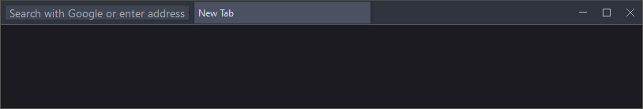

# Oneliner Deluxe

## **Installation**

### 1. Download

Click the green 'Code' button above and then 'Download ZIP'

### 2. Copy files

- Extract contents of `@programFiles` into your Firefox install folder (example: `C:\Program Files\Mozilla Firefox`) 

- Extract contents of `@profileFolder` into your Firefox profile folder (example: `C:\Users\Dustee\AppData\Roaming\Mozilla\Firefox\Profiles\j6raiima.dustee`) 
 
how to find profile folder?
in firefox open the `about:profiles` page, look for the profile that is in use and open its Root Directory 

### 3. Tidy up toolbars

You can do it automatically by clicking the button that looks like this 

## **Optional setup**

### 1. Install a color theme

Here are some clean looking dark styles i recommend:
- [Dark One - any color](https://addons.mozilla.org/en-US/firefox/addon/dark-one-purple)
- [Dracula Dark](https://addons.mozilla.org/en-US/firefox/addon/dracula-dark-colorscheme)
- [Nord](https://addons.mozilla.org/en-US/firefox/addon/nord-theme-cool) / [Nord Polar Night](https://addons.mozilla.org/en-US/firefox/addon/nord-polar-night-theme)

### 2. User preferences

Open the `about:config` page and search for `onelinerdeluxe`. The changes you make should be immediately visible without the need to restart your browser.
